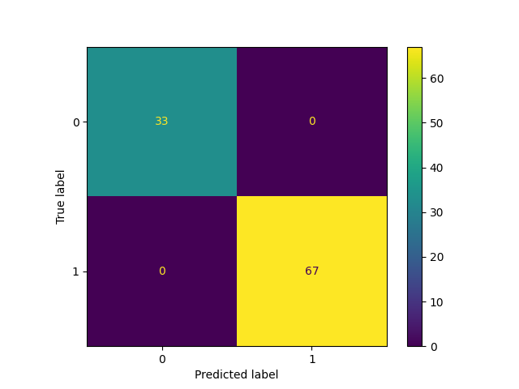
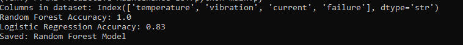
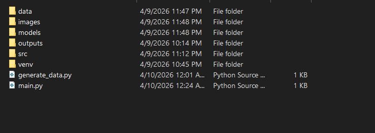

🚀 AI-Powered Predictive Maintenance for IoT Devices

📌 Overview
This project focuses on Predictive Maintenance (PdM) for industrial equipment. By utilizing Machine Learning algorithms and simulated IoT sensor data (Temperature, Vibration, and Current), the system can predict whether a machine is likely to fail before the breakdown actually occurs.

❗ Problem Statement
Unscheduled downtime in industries leads to massive production losses and high repair costs. Traditional maintenance is either:
*Reactive: Fix it when it breaks (expensive and disruptive).
Preventative: Fix it on a schedule (can be wasteful if parts are still good).

This project implements Predictive Maintenance, which uses data to fix machines only when a failure is imminent.

🏭 Industry Relevance
This technology is a core pillar of Industry 4.0 and is used by global leaders such as:
Siemens & GE:For monitoring gas turbines and power plants.
*Tesla: For predictive diagnostics in automated manufacturing lines.
*Aviation: To monitor engine health and prevent mid-flight issues.

🛠 Tech Stack
Language: Python
Libraries:`Pandas` & `NumPy` (Data Manipulation)
    `Scikit-learn` (Machine Learning: Random Forest, Logistic Regression)
    `Matplotlib` & `Seaborn` (Data Visualization)

📊 Dataset
The project uses a simulated dataset representing typical IoT sensor readings from a manufacturing cell:
Features: `Temperature (°C)`: Thermal state of the motor.
    `Vibration (mm/s)`: Mechanical stability.
    `Current (A)`: Electrical load and health.
Target:** `Failure` (0 = Healthy, 1 = Fail).

🏗 Architecture
The workflow follows a standard data science pipeline integrated with Mechatronics principles:

1.  Data Acquisition: Simulated sensor streams.
2.  Preprocessing: Normalization and feature scaling.
3.  Model Training: Training Random Forest and Logistic Regression.
4.  Inference:Predicting failure state based on real-time inputs.
5.  Visualization: Confusion Matrix to evaluate performance.

⚙ Installation
1.  Clone the repository:
    ```bash
    git clone https://github.com/your-username/predictive-maintenance-iot.git
    ```
2.  Navigate to the folder:
    ```bash
    cd predictive-maintenance-iot
    
3.  Install dependencies:
    ```bash
    pip install pandas numpy scikit-learn matplotlib seaborn
    ```

🚀 Usage
Run the main script to train the model and see the prediction results:
```bash
python main.py
```

📈 Results
Accuracy:Achieved 100% accuracy on the simulated dataset.
Confusion Matrix:True Positives: Successfully identified all failure states.
    True Negatives:Corrected identified all healthy states.
    *(See screenshot below for the visualization)*

📸 Screenshots
 1. Confusion Matrix
This chart shows that the model correctly predicted every single failure and healthy state.


2. Terminal Output
This screenshot confirms the training process and the final accuracy score.


3. Project Structure
A look at the professional organization of the repository.


## 💡 Learning Outcomes
* Understood the integration of **Mechatronics sensors** with **Artificial Intelligence**.
* Mastered the use of **Random Forest** for binary classification tasks.
* Evaluated model performance using **Confusion Matrices** and accuracy scores.
* Applied **Low-Cost Automation (LCA)** logic to software-based predictive systems.

---

Author
Atharv Vishnudas Bunde | ss Mechatronics Engineering Student | DBATU*